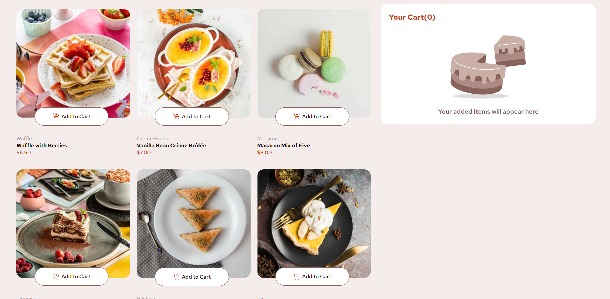

# Frontend Mentor - Product list with cart solution

This is a solution to the [Product list with cart challenge on Frontend Mentor](https://www.frontendmentor.io/challenges/product-list-with-cart-5MmqLVAp_d). 

## Overview
This is list of desserts that can be kept in the cart to confirm order.
### The challenge

Users should be able to:

- Add items to the cart and remove them
- Increase/decrease the number of items in the cart
- See an order confirmation modal when they click "Confirm Order"
- Reset their selections when they click "Start New Order"
- View the optimal layout for the interface depending on their device's screen size
- See hover and focus states for all interactive elements on the page

### Screenshot

### Links

- Solution URL: [Add solution URL here](https://github.com/AD9-1/product-list)
- Live Site URL: [Add live site URL here](https://your-live-site-url.com)

## My process

### Built with

- Semantic HTML5 markup
- CSS custom properties
- Flexbox
- CSS Grid
- [React](https://reactjs.org/) - JS library
- [Styled Components](https://styled-components.com/) - For styles

### What I learned
I learnt here react-redux, where I am managing the product increment, decrement by globally.Used state managementtool to manage the cart state.Order confirmation modal is also manged by react-redux.

To see how you can add code snippets, see below:

import { legacy_createStore as createStore } from "redux";

///Actions

export const addToCart = (item) => ({
  type: "addtocart",
  payload: item,
});
export const incrementCart = (item) => ({
  type: "increment",
  payload: item,
});
export const decrementCart = (item) => ({
  type: "decrement",
  payload: item,
});
export const removeFromCart = (item) => ({
  type: "removefromcart",
  payload: item,
});
export const openModal = () => ({
  type: "openmodal",
});
export const closeModal = () => ({
  type: "closemodal",
});
const initialState = { cart: [], isModalOpen: false };

const cartReducer = (state = initialState, action) => {
  switch (action.type) {
    case "addtocart":
      return {
        isModalOpen:false,
        cart: [
          ...state.cart,
          {
            ...action.payload,
            quantity: 1,
            totalprice: parseFloat(action.payload.price),
          },
        ],
      };
    case "removefromcart":
      return {
        ...state,
        cart: state.cart.filter((item) => item !== action.payload),
      };

    case "increment":
      return {
        ...state,
        cart: state.cart.map((item) => {
          if (action.payload.name === item.name) {
            const newQuantity = item.quantity + 1;
            return {
              ...item,
              quantity: newQuantity,
              totalprice: newQuantity * parseFloat(item.price),
            };
          }
          return item;
        }),
      };
    case "decrement":
      return {
        ...state,
        cart: state.cart
          .map((item) => {
            if (action.payload.name === item.name && item.quantity >= 1) {
              const newQuantity = item.quantity - 1;
              return {
                ...item,
                quantity: newQuantity,
                totalprice: newQuantity * parseInt(item.price),
              };
            }
            return item;
          })
          .filter(
            (item) => !(action.payload.name === item.name && item.quantity == 0)
          ),
      };
    case "openmodal":
      return {
        cart: state.cart,
        isModalOpen: true,
      };
    case "closemodal":
      return {
        cart: [],
        isModalOpen: false,
      };
    default:
      return state;
  }
};
const store = createStore(cartReducer);

export default store;

## Author

- Website - [Add your name here](https://www.your-site.com)
- Frontend Mentor - [@AD9-1](https://www.frontendmentor.io/profile/AD9-1)

